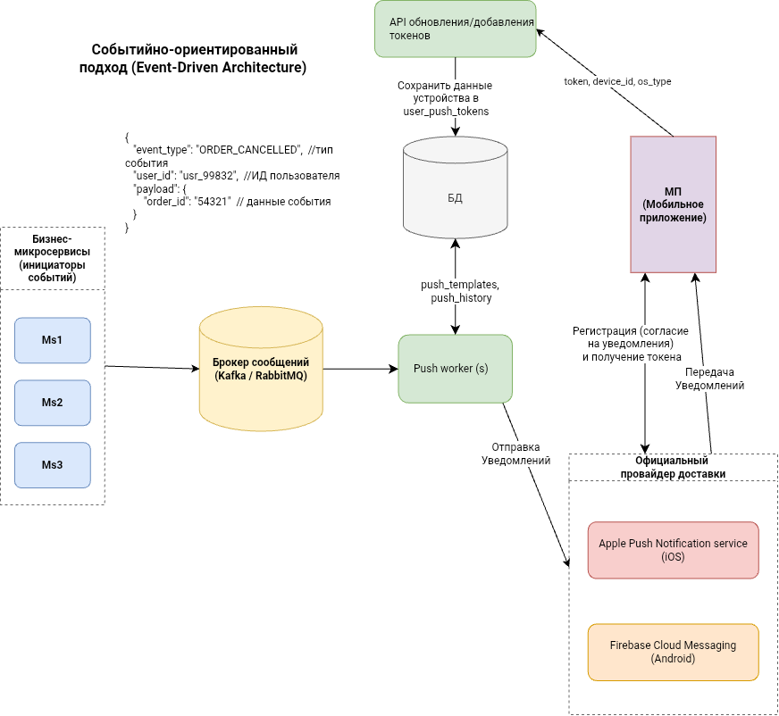
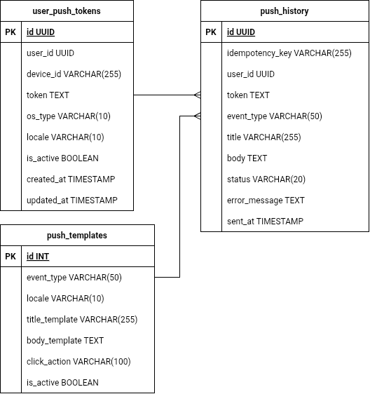

# Тестовое задание Effective mobile
## Задача 1.

* **п. 2 противоречит п. 9.** Лучше сделать и кнопку, и уменьшать до 0. При уменьшении до 0 выдавать окно подтверждения.
* **п. 13 противоречит п. 7** (лучше оставить п. 7 или выделять изменившуюся цену цветом и пояснением)
* **п. 1, 3, 4:** если добавить 5 разных товаров (3) то не получится сделать количество до 10 для каждого (1), потому что общее количество не может быть больше 20 шт.
  * Какой бизнес смысл заложен? Для чего такие правила? Предполагаю что должны соблюдаться все 3 условия. 
* **п. 4.** Все ли товары измеряются в штуках? Есть ли дробные единицы измерения?Вес, объем? Предлагаю сделать настройку лимита по весу и объему.
* **п. 5 и 3** можно объединить.
* **п. 6.** Лучше указать какой из лимитов превышен. Отображать полоски исчерпания лимитов (индикаторы и). 
  
* **п 8** - добавить общую сумму и количество (если п. 4 актуален)
* **п. 10** - уточнить в каком виде и количестве. Именно тех, которых нет в корзине? Если убрать товар из корзины - может появиться реклама этого товара? Можно сразу у рекламируемого товара добавить кнопку "купить", указывать цену.
* **п. 11** "По утрам и вечерам" - уточнить с какого часа по какой. Уточнить, что должен быть учтен часовой пояс пользователя.
  * Можно предложить с 7 до 10 и с 16 до 23 (когда возможно пользователь не на работе)
  * Почему нельзя в выходные показывать? Скорее всего в выходные надо показывать всегда.

## Дополнительно:
* добавлять товар не больше остатка на складе. 
* при заказе, открытии корзины и раз в минуту проверять наличие на складе. Отображать предупреждение и выделение цветом, если товара стало меньше. 

## Задача 2.

Поля: название (Name), ссылка на файл-логотип (logo_url), ссылка на внешний ресурс (external_url), описание (description)

Request `/api/items?limit=50&cursor=base64code`
Response {
```json
  "data": [
    {
      "id": 1,
      "name": "METRO",
      "description": "Ближайшая доставка сегодня 21-23",
      "logo_url": "https://domain.com",
      "external_url": "https://metro.com"
    },
    {...},
    {...}
  ],
  "next_cursor": "base64code",
  "has_more": true
```
}

base64code = null при старте страницы
base64code = base64encode(sortfieldsjson)
sortfieldsjson = "{"id": 110}"

Далее при формировании SQL используется фильтрация по "курсору":
    where id < 110
    order by id desc
    limit 50 + 1
    
has_more = result_count > limit

## Задача 3.
### push уведомления в мобильном приложении. 
Событийно-ориентированный подход (**Event-Driven architecture**)


| Компонент архитектуры | Тип / Стек технологий | Назначение и зона ответственности |
| :--- | :--- | :--- |
| **Бизнес-микросервисы** *(Заказы, Корзина, CRM и т.п.)* | Backend-сервисы (Go / Java / Python / C#) | Регистрируют бизнес-события (отмена заказа, доставка, запуск акции) и отправляют минимально необходимые данные (ID пользователя, ID заказа и т.п.) в брокер сообщений. |
| **Брокер сообщений** *(Kafka / RabbitMQ)* | Инфраструктура очереди данных | Служит асинхронной шиной данных. Изолирует бизнес-сервисы от процесса отправки уведомлений. Гарантирует, что при пиковых нагрузках или сбое сервиса сообщения не потеряются, а встанут в очередь. |
| **API Обновления токенов** | Микросервис (REST / gRPC) | Публичная точка входа для мобильных приложений. Принимает PUSH-токены от них и обновляет их в БД. |
| **БД** | Реляционная СУБД (PostgreSQL) | Хранит маппинг пользователей и их устройств (`user_id -> tokens`), типы ОС, языковые настройки, флаги активности токенов, шаблоны сообщений и историю |
| **Push Workers** | Фоновые асинхронные процессы | Читают события из брокера, проверяют идемпотентность, достают токены пользователя из БД, подставляют переменные в шаблоны текстов для разных событий, логируют отправку и совершают отправку к внешним провайдерам. Можно масштабировать (Kubernetes) по размеру очереди. |
| **Google FCM** *(Firebase Cloud Messaging)* | Внешний облачный сервис (Google) | Облачный провайдер доставки. Принимает готовый JSON-микросервиса и доставляет его на конкретные Android-устройства. |
| **Apple APNs** *(Apple Push Notification service)* | Внешний облачный сервис (Apple) | Официальный провайдер доставки Apple. Принимает от воркера сообщения и отправляет их на iPhone/iPad пользователей. |
| **Мобильное приложение** | Клиент (React Native / Flutter / Native) | Запрашивает разрешение на уведомления у ОС, передает полученный токен в API. Также обрабатывает бизнес-логику нажатий на уведомления. |

### Схема БД. 


### Token Lifecycle

1. **Генерация:** при первом запуске МП запрашивает разрешение на пуши. ОС выдает `token` $\rightarrow$ `/api/push/tokens`
2. **Обновление** (обновили приложение, восстановление из backup, изменение диска) $\rightarrow$ отправка на backend
3. **Деактивация** — при удалении пуша или Log out. `/api/auth/logout`
